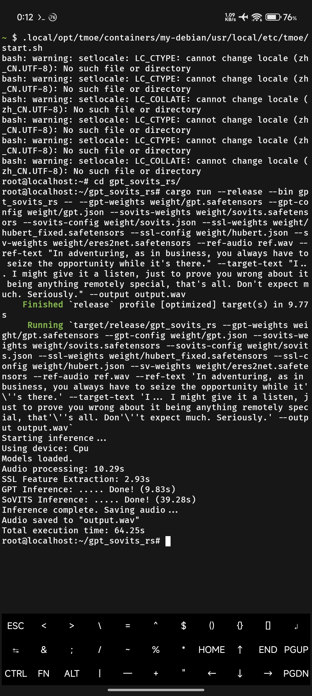
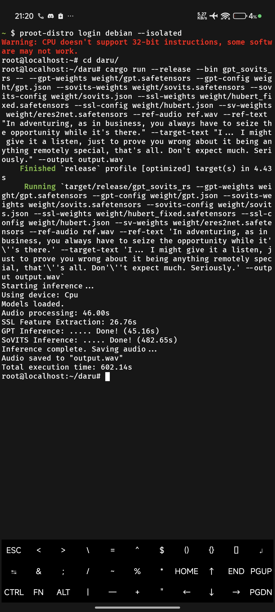

[English](#english) | [Bahasa Indonesia](#bahasa-indonesia)

---

<a name="english"></a>
## 🇬🇧 English

### Inspiration & Credits
This project is heavily inspired by the original **[TMOE-Linux](https://gitee.com/mo2/linux)** project. I would like to express my deepest gratitude to the original author for their incredible work, which served as the foundation for this tool.

### Motivation
The primary motivation behind creating this fork/tool is **performance**. 

While **[proot-distro](https://github.com/termux/proot-distro)** is an excellent tool that greatly simplifies running Linux distributions on Termux, I found its performance—specifically for **inference tasks**—to be slower than ideal for my workflow.

> [!NOTE]
> Performance comparisons generally focus on my specific use case (inference). Results may vary for other scenarios (e.g., compilation) which have not been extensively tested.

The original **TMOE** project offered the performance characteristics I was looking for, potentially due to its specific `proot` optimizations and configuration. However, I found the setup process to be overly complex for my personal needs.

**This project aims to bridge that gap:** providing the performance benefits of TMOE's proot configuration with a much simpler, cleaner, and more maintainable setup experience.

### Performance Comparison
We compared the inference time of a sample task on **TMOE** versus **proot-distro**.
**Test Environment:** Xiaomi 14T Pro.

| TMOE | Proot Distro |
| :---: | :---: |
|  |  |

As shown, TMOE demonstrates significantly faster inference times compared to standard proot-distro defaults, making it ideal for on-device development and heavy tasks.

### Usage

#### Installation
You can install TMOE using the simple one-line installer:

```bash
curl -L https://raw.githubusercontent.com/GaJe48/tmoe/master/install.sh | bash
```

#### Commands
*   **List Containers**: `tmoe list`
*   **Install Distribution**: `tmoe distro debian my-container`
*   **Login**: `tmoe login my-container`

### Bugs and Contributions
Found a bug? Have an idea for improvement?
Contributions are welcome! Please feel free to open an issue or submit a pull request.

---

<a name="bahasa-indonesia"></a>
## 🇮🇩 Bahasa Indonesia

### Inspirasi & Kredit
Proyek ini sangat terinspirasi dari proyek asli **[TMOE-Linux](https://gitee.com/mo2/linux)**. Saya ingin mengucapkan terima kasih sebesar-besarnya kepada penulis asli atas karya luar biasa mereka yang menjadi inspirasi dasar dari alat ini.

### Motivasi
Motivasi utama saya membuat ini adalah masalah **performa**.

Meskipun **[proot-distro](https://github.com/termux/proot-distro)** sangat memudahkan penggunaan Linux di Termux, saya merasa performanya—terutama untuk **tugas inferensi**—terasa kurang optimal untuk workflow saya.

> [!NOTE]
> Perbandingan performa di sini berfokus pada use case spesifik saya (inference). Hasil mungkin berbeda untuk skenario lain (misalnya kompilasi) yang belum diuji secara mendalam.

Proyek asli **TMOE** memberikan performa yang saya cari. Namun, hal yang kurang saya sukai adalah proses setup-nya yang terlalu ribet dan kompleks.

**Proyek ini dibuat untuk mengatasi masalah tersebut:** memberikan performa tinggi ala TMOE namun dengan setup yang jauh lebih simpel, mudah dibaca, dan mudah di-maintain.

### Perbandingan Performa
Kami membandingkan waktu inferensi pada task sample menggunakan **TMOE** vs **proot-distro**.
**Test Device:** Xiaomi 14T Pro.

| TMOE | Proot Distro |
| :---: | :---: |
|  |  |

Terlihat bahwa TMOE memiliki waktu inferensi yang jauh lebih cepat dibandingkan konfigurasi standar proot-distro, menjadikannya pilihan ideal untuk development di HP (on-device) dan tugas-tugas berat.

### Cara Pakai

#### Instalasi
Jalankan perintah berikut untuk menginstal:

```bash
curl -L https://raw.githubusercontent.com/GaJe48/tmoe/master/install.sh | bash
```

#### Perintah Dasar
*   **Lihat Container**: `tmoe list`
*   **Install Distro**: `tmoe distro debian nama-container`
*   **Login**: `tmoe login nama-container`

### Bug dan Kontribusi
Menemukan bug? Atau punya ide untuk fitur baru?
Kontribusi sangat diterima! Silakan buka *issue* atau kirimkan *pull request*.
